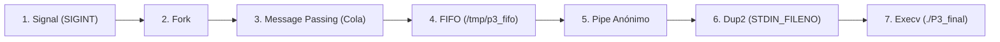

# P3: Seguidilla Dominó Secuencial (7 Técnicas POSIX)

El proyecto **P3** demuestra el uso de las **7 técnicas de Sistemas Operativos POSIX** ordenadas en una **cadena secuencial directa (efecto dominó)**. Cada técnica recibe los datos del paso anterior y se los transmite directamente a la siguiente.

---

## Flujo Secuencial de las 7 Técnicas

```text
[1. SIGNAL] ──> [2. FORK] ──> [3. MSG PASSING] ──> [4. FIFO] ──> [5. PIPE] ──> [6. DUP2] ──> [7. EXECV]
```

### Detalle de cada Paso:

1. **`1. Signalization (Señal 2 - SIGINT)`**:
   - El proceso principal está en espera pasiva con `pause()`.
   - Al enviar `kill -2 <PID>`, se dispara la función `manejador_sigint()` que da inicio a la cadena.

2. **`2. Fork`**:
   - La primera acción del manejador es ejecutar `fork()`, creando el proceso hijo que llevará los datos hasta el final.

3. **`3. Message Passing (Cola de Mensajes System V)`**:
   - El proceso Padre deposita los datos iniciales en la Cola (`msgsnd`).
   - El proceso Hijo los recibe desde la Cola (`msgrcv`).

4. **`4. FIFO (Tubería Nombrada)`**:
   - El Hijo toma la información recibida de la Cola y la escribe en el archivo FIFO en disco `/tmp/p3_fifo`.

5. **`5. Pipe (Tubería Anónima)`**:
   - El proceso abre la FIFO para leer los datos acumulados y los transfiere a una tubería anónima creada con `pipe()`.

6. **`6. Dup2`**:
   - Con `dup2(pipe_fd[0], STDIN_FILENO)`, el hijo redirige el extremo de lectura del Pipe hacia la **Entrada Estándar** (`STDIN_FILENO`).

7. **`7. Execv`**:
   - Se ejecuta `execv("./P3_final", args)`.
   - El programa independiente `P3_final.c` arranca, lee directamente de `STDIN_FILENO` y muestra en pantalla la traza completa por donde viajaron los datos.

---

## Diagrama Visual del Flujo



---

## Guía de Compilación y Prueba

### 1. Compilación:
```bash
gcc -Wall P3_final.c -o P3_final
gcc -Wall P3_cadena.c -o P3_cadena
```

### 2. Ejecución:
En la primera terminal corre:
```bash
./P3_cadena
```

### 3. Prueba:
En una segunda terminal, dispara la señal (sustituye `<PID>` por el PID que te imprima en pantalla):
```bash
kill -2 <PID>
```

**Resultado en pantalla:**
Verás la traza donde se muestra cómo los datos se fueron acumulando a través de los 7 pasos secuenciales hasta imprimir el resultado final con `./P3_final`.
