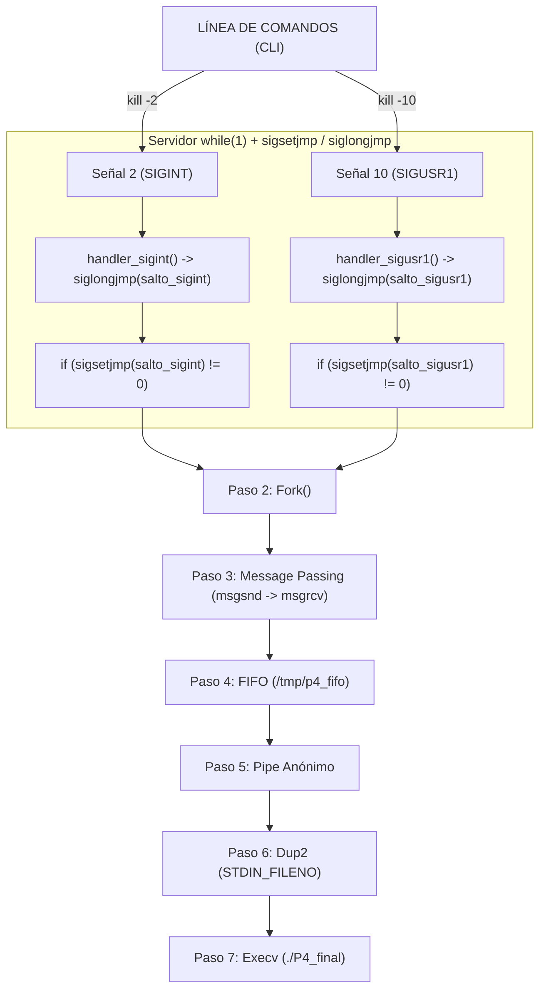

# P4: Servidor Continuo con Patrón Lab 2 (`sigsetjmp` / `siglongjmp`) y Cadena de 7 Técnicas POSIX

1. **Un bucle servidor `while (1)`** con suspensiones pasivas `pause()`.
2. **Englobe de múltiples señales en el `while(1)`** mediante puntos de retorno `sigsetjmp` y saltos de señal `siglongjmp`.
3. **Disparo de la cadena dominó secuencial de las 7 técnicas POSIX** tras cada salto de señal capturado.

---

## Cómo Funciona el Englobe de Señales de Lab 2 en P4

En lugar de procesar la lógica pesada directamente dentro de la función del manejador (lo cual puede causar problemas de concurrencia), el manejador de la señal solo realiza un **salto de contexto no local** (`siglongjmp`):

```c
// Manejador súper liviano (Patrón Lab 2)
void handler_sigint(int signo) {
    (void)signo;
    siglongjmp(salto_sigint, 1); // Salta directamente al while(1) del main
}
```

Y en el bucle principal `while(1)` del programa servidor:

```c
while (1) {
    // Si sigsetjmp retorna distinto de 0, significa que se activó la señal SIGINT
    if (sigsetjmp(salto_sigint, 1) != 0) {
        printf("¡Se realizó el salto de código (SIGINT)!\n");
        disparar_cadena_7_tecnicas("SIGINT - PETICIÓN ESTÁNDAR", 2);
    }

    // Si sigsetjmp retorna distinto de 0, significa que se activó la señal SIGUSR1
    if (sigsetjmp(salto_sigusr1, 1) != 0) {
        printf("¡Se realizó el salto de código (SIGUSR1)!\n");
        disparar_cadena_7_tecnicas("SIGUSR1 - DIAGNÓSTICO SERVIDOR", 10);
    }

    pause(); // Suspende el proceso hasta la próxima señal
}
```

---

## Diagrama del Flujo (Patrón Lab 2 + 7 Técnicas)



---

## Guía de Compilación y Ejecución

### Compilación:
```bash
gcc -Wall P4_final.c -o P4_final
gcc -Wall P4_servidor.c -o P4_servidor
```

### Ejecución:
En una terminal corre:
```bash
./P4_servidor
```

### Pruebas desde otra terminal:
Reemplaza `<PID>` por el PID del servidor mostrado en pantalla:

1. **Señal 2 (SIGINT)**:
   ```bash
   kill -2 <PID>
   ```

2. **Señal 10 (SIGUSR1)**:
   ```bash
   kill -10 <PID>
   ```

Observa en la consola del servidor cómo se realiza el salto de código con `sigsetjmp` idéntico a tu Lab 2 y se desencadena la cadena secuencial de 7 técnicas.
